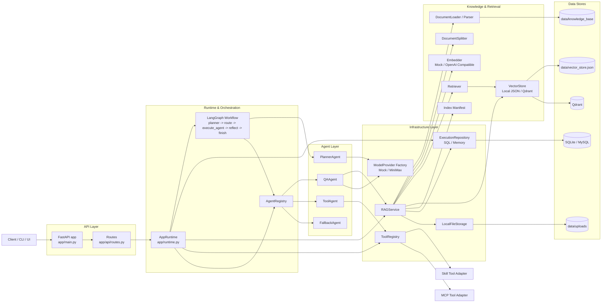
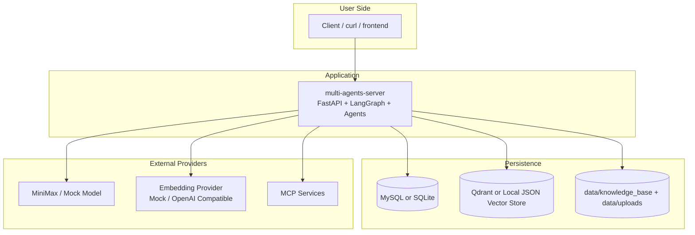

# 项目架构概览

这个项目是一个基于 `FastAPI + LangGraph + RAG + 可插拔工具/模型/存储` 的多 Agent 问答服务。当前实现同时覆盖了两类主链路：

1. 在线问答链路：接收 `/v1/chat` 请求，经过 Planner 规划后分发给 `QAAgent`、`ToolAgent` 或 `FallbackAgent`。
2. 知识库链路：支持知识库创建、文档上传、异步切分/向量化/入库，以及查询时的检索增强回答。

## 分层设计

- 接入层：`app/main.py`、`app/api/routes.py`
  - 提供 HTTP API、请求上下文、中间件、异常处理、健康检查。
- 运行时装配层：`app/runtime.py`
  - 统一构建模型、仓储、RAG、工具注册表、Agent 注册表和 LangGraph 工作流。
- 编排层：`app/graph/workflow.py`
  - 定义 `planner -> route -> execute_agent -> reflect -> finish` 的状态机。
- 能力层：`app/agents/*`
  - `PlannerAgent` 负责选路。
  - `QAAgent` 负责基于知识库检索结果生成答案。
  - `ToolAgent` 负责选择和调用工具。
  - `FallbackAgent` 负责失败兜底。
- 基础设施层：`app/models/*`、`app/tools/*`、`app/rag/*`、`app/repositories/*`
  - 模型适配、工具适配、向量检索、文件存储、数据库持久化都在这一层。
- 数据层：`data/*`、SQLite/MySQL、Local Vector Store/Qdrant
  - 保存会话轨迹、知识库元数据、知识块、向量索引和原始上传文件。

## 整体架构图



## 核心执行链路

### 1. Chat 请求链路

```text
Client
  -> FastAPI Route
  -> AppRuntime.handle_chat()
  -> LangGraph planner
  -> AgentRegistry.run()
  -> QAAgent / ToolAgent / FallbackAgent
  -> 组装 ChatResponse
  -> Repository 持久化 session/message/agent_run/tool_call
```

关键点：

- `PlannerAgent` 优先用模型输出结构化计划，失败时退化到启发式路由。
- `reflect` 节点会根据 agent 成败决定继续执行、重规划或降级到 `FallbackAgent`。
- 所有请求都会记录会话、消息、Agent 运行轨迹和工具调用轨迹。

### 2. 知识库构建链路

```text
docs/knowledge_base 或 上传文档
  -> Parser / Loader
  -> DocumentSplitter
  -> Embedder
  -> VectorStore
  -> Manifest + Repository
```

关键点：

- 默认知识库来自 `data/knowledge_base`，由 `scripts/build_kb.py` 或启动脚本自动构建。
- 上传文档先落本地文件，再创建 ingestion job，后台执行解析、切分、向量化和入库。
- `manifest` 用于校验 embedding 指纹、维度、chunking 配置和向量库状态是否一致。

## 部署拓扑图

当前项目支持两种典型运行形态：

1. 本地轻量模式：`SQLite + Local Vector Store(JSON)`
2. Docker 开发模式：`MySQL + Qdrant`



## 当前架构特点

- 优点
  - 运行时装配集中，模块边界比较清晰，便于替换模型、向量库和数据库。
  - Chat 主链路和知识库生命周期已经解耦，适合继续演进成更完整的 Agent 平台。
  - RAG 和工具调用都通过适配器模式实现，扩展成本低。

- 当前约束
  - 工作流仍是单请求内串行执行，尚未引入并行 agent 或更复杂的调度策略。
  - 文档 ingestion 目前依赖应用内后台任务，缺少独立任务队列/worker。
  - 工具注册依赖配置与本地 handler，规模扩大后需要更强的权限、审计和发现机制。
