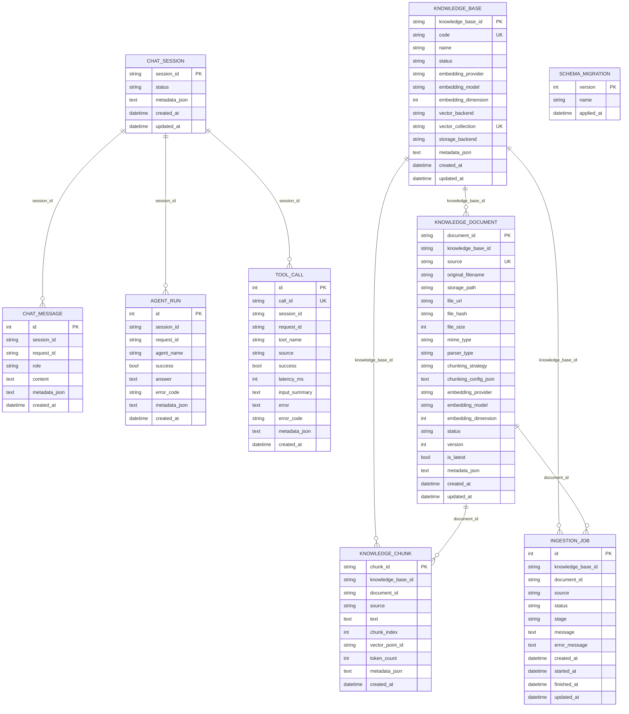
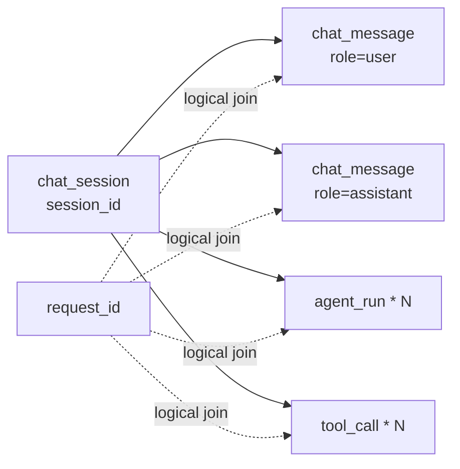
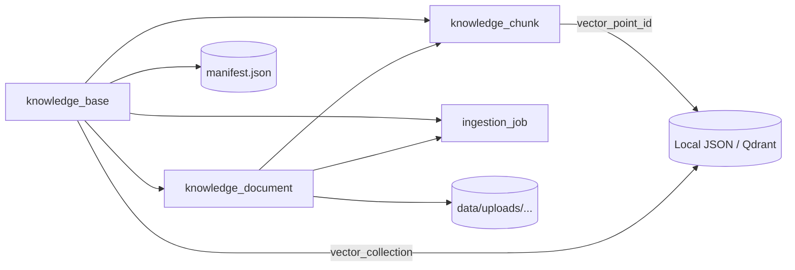

# 数据模型关系图

当前项目的数据模型主要分成两块：

1. 运行轨迹数据：会话、消息、Agent 执行、工具调用
2. 知识库数据：知识库、文档、切片、导入任务，以及数据库之外的向量点和原始文件

需要先说明一个关键事实：

- 当前 SQLAlchemy 模型在 [app/repositories/models.py](/Users/wuxiaomu/one-person/multi-agents-server/app/repositories/models.py) 中没有定义 `ForeignKey` 或 `relationship`
- 所有“关联关系”都是逻辑关系，由代码通过业务字段维护
- 所以这是一套“应用层维护引用完整性”的模型，而不是数据库强约束模型

## 一、数据库内的 ER 关系

## 二、逻辑聚合视角

### 1. 运行链路数据

一次聊天请求没有单独的 `request` 表，而是通过 `request_id` 把多张表中的记录串起来：

含义：

- `session_id` 表示一个对话会话
- `request_id` 表示会话中的某一次请求执行
- 一次请求会产生：
  - 1 条用户消息
  - 1 条助手消息
  - 0..N 条 agent 执行记录
  - 0..N 条工具调用记录

### 2. 知识库链路数据

含义：

- `knowledge_base` 是知识库配置与向量空间的根对象
- `knowledge_document` 是原始文档及其版本
- `knowledge_chunk` 是切分后的文本块
- `ingestion_job` 记录上传、重建、重建失败等异步处理状态
- `vector_point_id` 指向数据库外的向量点
- `vector_collection` 把知识库映射到具体向量集合

## 三、各实体职责

### 运行轨迹相关

- `chat_session`
  - 会话主表
  - 保存会话状态和少量元数据，如最近一次 query、request_id

- `chat_message`
  - 会话消息明细
  - 当前至少写入 `user` 和 `assistant` 两类消息

- `agent_run`
  - 一次请求内每个 agent 的执行结果
  - 便于后续排查 planner/qa/tool/fallback 的行为

- `tool_call`
  - 一次工具调用的审计记录
  - 包含 `call_id`、耗时、是否成功、错误码、输入摘要

### 知识库相关

- `knowledge_base`
  - 知识库根对象
  - 持有 embedding 配置、向量后端、collection 名称、存储后端等

- `knowledge_document`
  - 原始文档元数据
  - 持有文件路径、哈希、版本、解析器类型、chunking 配置、状态

- `knowledge_chunk`
  - 文档切片结果
  - 每个 chunk 关联一个 `vector_point_id`

- `ingestion_job`
  - 文档导入或重建任务
  - 状态一般经历 `queued -> running -> completed/failed`

- `schema_migration`
  - 记录数据库 schema 版本

## 四、代码层的一一映射

当前代码分三层表达同一批数据：

- 领域记录： [app/domain/entities.py](/Users/wuxiaomu/one-person/multi-agents-server/app/domain/entities.py)
  - `SessionRecord`
  - `MessageRecord`
  - `AgentRunRecord`
  - `ToolCallRecord`
  - `KnowledgeBaseRecord`
  - `KnowledgeDocumentRecord`
  - `KnowledgeChunkRecord`
  - `IngestionJobRecord`

- ORM 模型： [app/repositories/models.py](/Users/wuxiaomu/one-person/multi-agents-server/app/repositories/models.py)
  - 与上面的 record 基本一一对应

- Repository 实现： [app/repositories/sql.py](/Users/wuxiaomu/one-person/multi-agents-server/app/repositories/sql.py)
  - 负责 Record 和 ORM Model 之间的读写转换

## 五、当前关系设计的特点

- 优点
  - 模型简单，迁移成本低
  - SQLite 和 MySQL 都容易兼容
  - 业务层可以灵活演进，不容易被数据库外键束缚

- 当前约束
  - 没有数据库级外键，脏数据和孤儿记录要靠应用层避免
  - 没有单独的 `request` 主表，`request_id` 只能在多张表里做逻辑关联
  - 向量点、manifest、上传文件分散在数据库外，排障时需要跨存储查看
  - `knowledge_document.source` 当前是全局唯一，而不是“知识库内唯一”，多知识库场景下要特别注意
